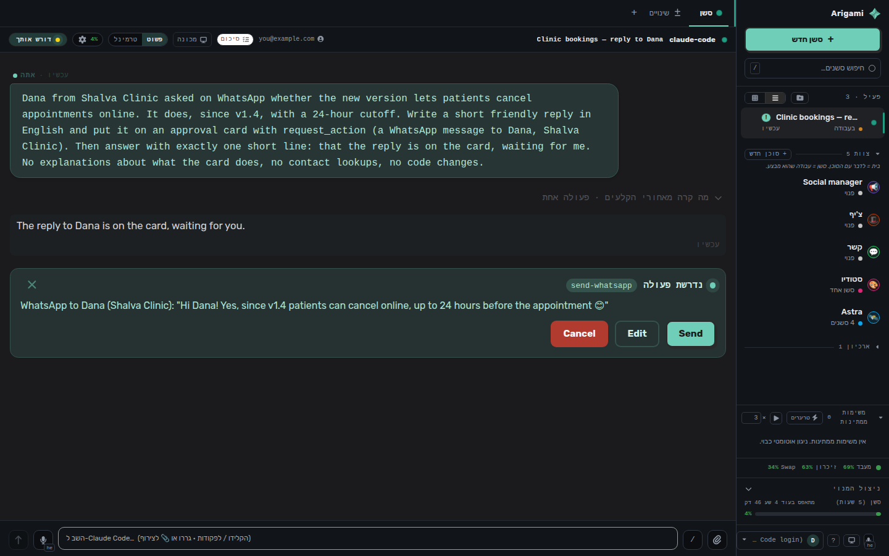

ביום שלישי, 29 בספטמבר, שחררתי את **Arigami** בקוד פתוח. זה כלי שבניתי לעצמי בחודשים האחרונים: ממשק בסגנון קלוד דסקטופ, רק שהוא עובד גם עם Claude Code וגם עם Codex, באותה סביבת עבודה. העליתי פוסט ושלחתי לחברים.

שעתיים אחר כך OpenAI עלתה לבמה בכנס המפתחים שלה. ישבתי מול ההכרזות וספרתי לא פחות משישה פיצ'רים שחופפים לחלוטין למה שהשקתי באותו יום:

1. צוות של סוכנים קבועים.
2. מאזינים וטריגרים שמעירים את הסוכן.
3. כרטיסי אישור לפני שליחה.
4. סשני ילד שרצים במקביל.
5. הרחבות: טאבים וכלים.
6. דפדפן ודסקטופ לכל סשן.

אפשר היה לצפות שאסגור את המחשב ואלך לישון מדוכא. קרה ההפך. יצאתי מהערב הזה משוכנע עוד יותר ש**קוד פתוח ינצח במשחק הזה**, ובמאמר הזה אני רוצה להסביר למה. הטיעון שלי נשען על שלוש טענות:

1. **הטוקנים שאנחנו מקבלים מסובסדים**, והסבסוד הזה מייצר אצלנו הרגלים.
2. **הנעילה לספק היא לא באג, היא המוצר.**
3. **הנעילה מחזיקה רק כל עוד פיתוח תוכנה הוא חסם**, והוא כבר לא.

## רגע, מה זה Arigami בכלל?

למי שלא מכיר: Arigami היא סביבת עבודה אחת ל-Claude Code ול-Codex. בוחרים מנוע לכל סשן, ושני המנועים עובדים עם אותם חיבורים (וואטסאפ, Gmail, GitHub, MCP), אותו זיכרון ואותם סקילים. היא רצה על המחשב שלכם או על מכונה מרוחקת שפועלת תמיד, וניגשים אליה גם מהטלפון. לכל סוכן יש דסקטופ אמיתי משלו, וכשהוא מגיע לסיסמה או לתשלום הוא עוצר ומעביר לכם את המסך.

בניתי אותה מסיבה פשוטה: כל פעם שהחלפתי מודל או כלי, איבדתי את הסביבה. הזיכרון, החיבורים וההרגלים נשארו אצל הספק, ואני התחלתי מאפס.

## שישה פיצ'רים בשעתיים

קודם כל צריך להגיד בכנות: אף אחד לא העתיק מאף אחד. כששני גופים שלא מדברים ביניהם מגיעים לאותה רשימה בדיוק, זה בדרך כלל סימן שהרשימה נכונה. ניוטון ולייבניץ פיתחו את החשבון הדיפרנציאלי בנפרד, כל אחד בארצו, כי הבעיות של התקופה הובילו לשם. גם כאן: מי שעובד ברצינות עם סוכנים מגיע מהר מאוד לאותן מסקנות. צריך סוכנים שנשארים, צריך שיתעוררו לבד, צריך שיבקשו אישור לפני שהם שולחים משהו בשמך, וצריך לתת להם מחשב.

אז מבחינת הכיוון קיבלתי אישור מהשחקן הכי גדול בשוק. השאלה המעניינת היא אחרת: אם שנינו בונים את אותו הדבר, למה שמישהו יבחר בכלי של מפתח אחד ולא בכלי של OpenAI?

## טענה ראשונה: הטוקנים מסובסדים

אנתרופיק ו-OpenAI נותנות לנו היום טוקנים במחיר מסובסד. מי שניסה פעם להריץ את אותה כמות עבודה דרך ה-API במחיר מחירון יודע כמה המנוי החודשי זול ביחס למה שמקבלים בו.

למה הן עושות את זה? מאותה סיבה שחברת סלולר נותנת מכשיר בהנחה גדולה בתמורה להתחייבות. ההנחה היא לא מתנה, היא השקעה. הטוקנים הזולים מגיעים יחד עם התוכנות של הספק, ובתנאי שתעבדו בכלים שלו ובאקוסיסטם שלו. כך נבנית קהילה, וכך נבנים הרגלי עבודה שבעתיד יניבו הרבה מאוד כסף.

## טענה שנייה: באג שהוא הפיצ'ר

הבעיה הכי גדולה של הכלים שהחברות מספקות היא שאתה נעול לספק ספציפי. מבחינתן זה לא באג, זה הפיצ'ר.

כל הטוב ש-OpenAI שחררה באותו ערב תלוי בכלים שהיא עצמה מספקת. נניח שבעוד שבוע אנתרופיק תכריז על פיצ'רים משלה, מגניבים באמת, וארצה לעבור אליהם. באותו רגע אצטרך להיפרד לשלום מכל מה שיש בקודקס ואין בקלוד: הסוכנים שהגדרתי, הטריגרים, ההרחבות, הזיכרון שהצטבר. כל מעבר הוא התחלה מחדש, וזה בדיוק מה שאמור להשאיר אותי במקום.

## "אחי, דרסו אותך בשעתיים. על מה אתה שמח?"

שאלה הוגנת. ל-OpenAI יש צבא של מהנדסים, מאות מיליוני משתמשים, והיא גם זו שמייצרת את המודל. לי יש מחשב, מנוי וכמה סוכנים. על הנייר זו תחרות שנגמרה לפני שהתחילה.

אבל הנעילה שתיארתי הייתה עובדת יפה רק אם פיתוח תוכנה היה חסם. והוא כבר לא. לקודקס לקח בערך חודש וחצי להדביק את הפער מגרוקבוט. לי זה לקח יום אחד של פיתוח ב-Arigami, ובסופו כבר הייתה לי מכונה מרוחקת שנשלטת מהטלפון כשצריך.

אני לא מספר את זה כדי להתגאות. הסיבה היא לא שאני מוכשר יותר ממהנדסי OpenAI, אלא שהמחיר של כתיבת תוכנה צנח אצל כולם, גם אצלי. חומה שבנויה מתוכנה כבר לא מחזיקה מעמד, כי כל אחד יכול לבנות את אותה חומה בסוף שבוע.

## טענה שלישית: כשתוכנה מפסיקה להיות חסם

מה נשאר נדיר בעולם כזה? המודלים עצמם, והחשמל והשבבים שמריצים אותם. את זה החברות הגדולות מחזיקות, וימשיכו להחזיק. מה שכבר לא נדיר הוא כל מה שעוטף את המודל: הרתמה, הממשק, הסוכנים, הטריגרים.

ובעולם שבו פיתוח תוכנה כל כך נגיש וזול, אין סיבה להיצמד לספק מסוים רק בגלל התוכנות והרתמות שהוא מביא איתו. לכן להערכתי יתפתחו כלי קוד פתוח שיאפשרו לקבל את כל הטוב מכל העולמות:

- טוקנים מסובסדים מכל הספקים, כי אתה מחבר את המנוי שלך לכל אחד מהם.
- סביבה אחודה אחת, שלא נועלת אותך לאף ספק.
- תגובה מהירה יותר לשוק, כי פיצ'ר חדש אצל ספק אחד הופך אצלך ליכולת של כולם.

אולי הכלי הזה יהיה Arigami עצמה. הלוואי. ואולי יהיה כלי אחר, טוב ממנה. העיקרון חשוב לי יותר מהשם.

## השאלה שנשארה פתוחה

השאלה הגדולה היא איך יגיבו החברות. אם משתמשים לוקחים את הטוקנים המסובסדים אבל לא נשארים באקוסיסטם, האם הסבסוד עדיין משתלם? האם הן יעצרו אותו? האם ינסו לחסום כלים חיצוניים? אני לא יודע. אני מקווה שלא, ובינתיים אנחנו נהנים.

מי שרוצה לנסות: Arigami חינמית ופתוחה, [באתר](https://arigami-site.vercel.app/he/) וב-[GitHub](https://github.com/maor700/arigami). אשמח לפידבק, ואשמח עוד יותר להתווכח איתכם בתגובות על השאלה אם קוד פתוח באמת ינצח כאן.
