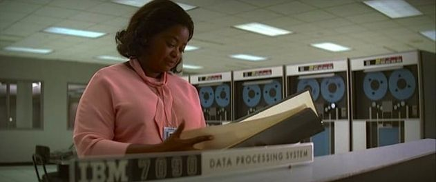

אני זוכר שלפני עשור בערך צפיתי בסרט **"מאחורי המספרים"** ([*Hidden Figures*](https://www.youtube.com/watch?v=DU7dgtKX30g)). בקצרה סרט המבוסס על סיפור אימיתי שמספר את ספורן של שלוש נשים שחורות בתחילת שנות השישים של המאה הקודמת שעבדו בנאס"א כמחשבות מתמטיות. מלבד הסיפור היפה על מעמדם של השחורים והנשים באותו זמן, יש שם סצנה אחת שלא יוצאת לי מהראש: דורותי ווהן, אישה חדה כתער, עומדת במסדרונות נאס"א ומביטה במפלצת הברזל החדשה של IBM. היא לא ראתה שם "קידמה" או "יעילות" – היא ראתה את גזר הדין של הקריירה שלה. עד אותו רגע, היא וחברותיה היו ה"מחשב"; הן מכרו לנאס"א את המוח שלהן ואת היכולת לפתור משוואות מורכבות ביד. ופתאום, קופסה שחורה ורועשת הגיעה כדי לעשות את זה בשבריר שנייה.

זה היה רגע של חרדה קיומית מזוקקת. דורותי לא חיכתה שמישהו יציל אותה; היא פרצה לחדר המחשב בלילה, למדה את שפת ה-Fortran והפכה למפעילה של המכונה לפני שהמכונה תהפוך אותה להיסטוריה.

ואכן פעם המשמעות של המילה [computer](https://en.wikipedia.org/wiki/Computer_(occupation)) היתה מקצוע של אדם שמחשב חישובים מתמטיים והיום המקצוע הזה ליטרלי הוחלף על ידי computer שהוא שם עצם ואין מקצוע כזה יותר.אבל היום, כשאני גולל בטוויטר או רואה את יכולות הבינה המלאכותית, אני מרגיש שאנחנו נמצאים בגרסה הרבה יותר אלימה של אותו רגע. המכונה של היום לא רק מחשבת מהר יותר – היא מתחילה לחשוב במקומנו.

## הדילמה: אבולוציה של כלים או החלפת השכל?

הוויכוח הציבורי סביב הסוגיה הזו תקוע כרגע בין שתי גישות מנוגדות, שכל אחת מהן נשענת על לוגיקה מוצקה:

- **הגישה ההיסטורית: "זה כבר קרה בעבר"** התומכים בגישה הזו טוענים שה-AI היא פשוט כלי העבודה הכי חזק שנוצר אי פעם. **ג'נסן הואנג**, מנכ"ל NVIDIA, טוען ש"האנגלית היא שפת התכנות החדשה" – מה שאומר שסוף סוף המחשב למד לדבר אנושית, וזה רק יפתח דלתות ליצירתיות שמעולם לא ראינו. הם מאמינים ב**פרדוקס ג'יבונס**: ככל שיהיה קל וזול יותר לייצר קוד ותוכן, העולם יצרוך אותם בכמויות אדירות שידרשו יותר "אדריכלים" אנושיים מאי פעם.
- **הגישה הסקפטית: "הפעם זה באמת שונה"** מנגד, ניצבת הגישה המזהירה שההשוואה לטרקטור או למכונית היא אשליה מסוכנת. דמויות כמו **סם אלטמן** (OpenAI) או **יובל נח הררי** מזהירים שבעבר החלפנו שרירים (מנועים), אבל תמיד נשאר לנו היתרון היחסי של "השכל". הפעם, המכונה נכנסת למבצר האחרון שלנו. **דניאל שרייבר** (מנכ"ל Lemonade) חיזק את הנקודה הזו ב[הרצאה מרתקת שנתן לאחרונה](https://www.youtube.com/watch?v=5gqtckj0Ohc) (שווה צפייה), שם הוא טוען שהאנלוגיה הנכונה היא נחיתה של "חייזרים" שמוכנים לעבוד בחינם, וכי בניגוד לעבר – הפעם המכונה מחליפה את האינטליגנציה עצמה.

## ניהול סיכונים: איך ניתן להתמודד עם החששות?

אז מי צודק? אף אחד לא יודע להכריע. אבל זה שאנחנו לא יודעים, לא פוטר אותנו מאחריות. בניהול סיכונים לא מחכים לוודאות – נערכים לתרחיש הגרוע ביותר. אם יש סיכוי שהפעם זה באמת שונה, ההשלכות חמורות מדי מכדי שנתעלם מהן. אופטימיות נאיבית היא לא אסטרטגיה.

לכן, יצרתי רשימה של כללים להתמודדות עם האיום הזה. הכללים האלו נובעים מהבנת צווארי הבקבוק הטכנולוגיים, הרגולטוריים והסוציולוגיים שעוד נותרו לנו:

1. **מבחן הדיגיטליות:** ה-AI חיה בממלכה הדיגיטלית. ככל שהתפקיד שלך דיגיטלי יותר (תכנות, שיווק, גרפיקה), כך החשיפה שלך לסיכון גבוהה יותר. להוציא אותה החוצה כרובוטים פיזיים ייקח עוד זמן (עשור להערכתי), ולכן תפקידי השטח כרגע מוגנים יותר.
2. **ניתוק התלות הכלכלית בזמן ובכישורים:** המודל של "שכר תמורת שעות עבודה" הולך להתערער. אם המכונה מייצרת ערך ביעילות אינסופית, האדם חייב למצוא נתיב הכנסה שלא קשור בזמן שלו. נצלו את זכויות הקניין שלכם: השקיעו בנכסים, בנדל"ן או בבורסה. המטרה היא לקחת חלק בסינגולריות הטכנולוגית דרך הבעלות, כך שהפרנסה שלכם לא תהיה תלויה בשאלה אם עבדתם היום או לא.
3. **הגנת הפוליטיקה (לטווח הקצר):** אף ארגון עובדים לא הציל את מוכרי הקרח מהמקרר, אבל לטווח הקרוב, בירוקרטיה כבדה וקבוצות כוח יגנו על חבריהן וייפגעו אחרונים.
4. **מבצר הדיפלומה:** מקצועות הדורשים הסמכה מהמדינה (רופאים, עורכי דין, חשמלאים) מוגנים על ידי רגולציה איטית. מקבלי ההחלטות ינסו להגן על הדיפלומות שלהם, אך בסוף – ההתייעלות הכלכלית תנצח גם שם.
5. **המעבר מפועל ליזם:** הערך של ה"איך" (הביצוע) נשחק. הערך של ה"מה" (היוזמה והחזון) נוסק. תפסיקו להיות ה"עבדים" של המשימות ותהיו ה"אדונים" שרותמים את סוכני ה-AI כדי להביא את החלומות שלכם לעולם.
6. **אנושיות כערך מוביל:** כשמידע וביצוע הופכים למוצר מדף זול, האנושיות הופכת ליקרה. תקשורת טובה, אמפתיה ויכולות חברתיות הופכים מ"נחמד שיהיה" לשיקול המרכזי שיישאיר אתכם רלוונטיים מול המעסיק או הלקוח.

## סיכום

אנחנו נמצאים בפתחו של עשור שבו הגישה האופטימית עשויה לנצח בטווח הקרוב, אך הגישה הסקפטית אורבת לנו מעבר לפינה. אל תחכו שה-IBM ינחת לכם על השולחן כדי לגלות שאתם מיותרים. תהיו דורותי ווהן: תלמדו לשלוט במכונה, אבל בו זמנית – תבנו לעצמכם בסיס כלכלי ונכסי שלא תלוי בה.אחרי שדיברנו עם רגליים על הקרקע אני רוצה לצלול לתחזית היהודית בסוגייה הזו שאומרת בגדול שהעבודה היא קללה שנתקללו בה אדם וחווה ובאחרית הימים הקללה הזו ביחד עם הקללות האחרות יעלמו מהעולם.על כך במאמר הבא.
